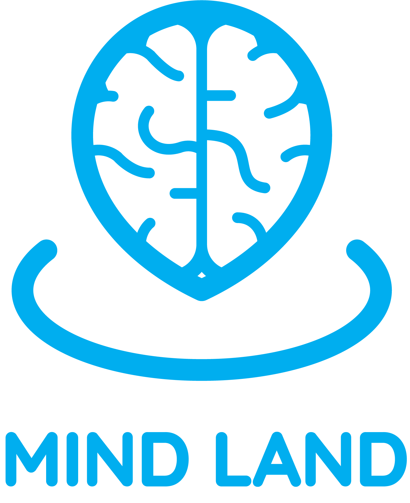

<<<<<<< HEAD
# Mind-Land
aplikasi kesehatan mental

#SIBXDicoding
=======
# Mind-Land 🧠
## apa itu Mind-Land?
Aplikasi "MindLand" adalah sebuah platform inovatif yang dirancang khusus untuk memberikan dukungan dan sumber daya kepada individu yang menghadapi gangguan mental. Aplikasi ini bertujuan untuk menciptakan komunitas yang inklusif dan mendukung 🤝, di mana pengguna dapat berinteraksi, berbagi pengalaman, dan mengakses informasi yang berguna untuk memahami dan mengatasi gangguan mental. 

## Instalasi
1. klon repositori ini dengan `git clone https://github.com/OnyanPokon/Mind-Land.git`
2. jalankan command `npm install` pada terminal
3. jalankan command `npm run dev` pada terminal
4. buka browser `http://localhost:5173`

>>>>>>> 87c8efa97ae2b8980869c975ed445990308f6a7c
